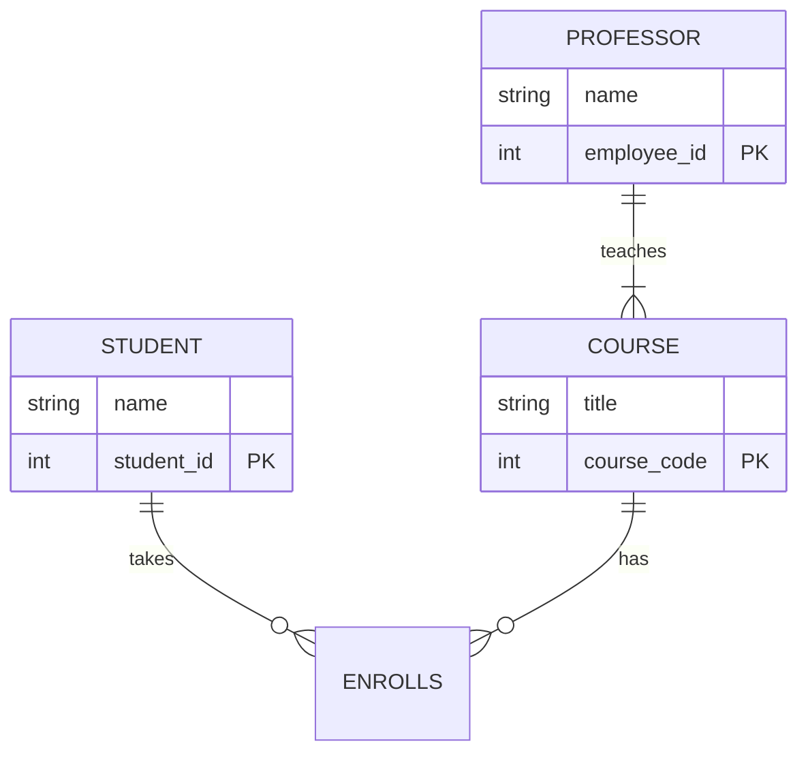

# 🎨 ER Modeling: Drawing the Reality

**Entity-Relationship (ER) Model** is how we draw the blueprint before building the database.

## 🧱 The Building Blocks

### 1. Entities (The Nouns)

Real-world objects.

- **Symbol**: Rectangle ▭
- **Examples**: `Student`, `Course`, `Car`.

### 2. Attributes (The Adjectives)

Properties of entities.

- **Symbol**: Ellipse ⬭
- **Examples**: `Name`, `Age`, `color`.
- **Key Attribute**: Unique ID (Underlined). `Student_ID`.

### 3. Relationships (The Verbs)

How entities interact.

- **Symbol**: Diamond ◈
- **Example**: Student **Enrolls** in Course.

## 🔗 Types of Relationships (Cardinality)

**Mental Hook: The Dance Partner Analogy**

1.  **One-to-One (1:1)**: Marriage (Traditional).
    - One Person ↔️ One Spouse.
2.  **One-to-Many (1:N)**: Mother & Children.
    - One Mother ↔️ Many Children.
    - (But a child has only ONE biological mother).
3.  **Many-to-Many (M:N)**: Students & Classes.
    - One Student takes Many Classes.
    - One Class has Many Students.

## 🧪 Weak Entities (The Dependent Child)

Some entities cannot exist without a "parent".

- **Example**: `Dependent` (Employee's child) relies on `Employee`.
- **Visual**: Double Rectangle ▣.
- **Key**: Partial Key (Dashed underline).

## 🧜‍♀️ Visualizing with Mermaid

_Tip: In the diagram above, a Professor teaches (1 or more) courses, but a Student can take (0 or more) courses._
