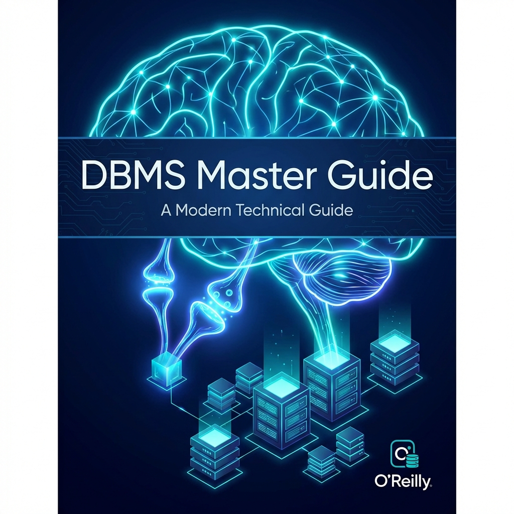

# DBMS Master Guide: Brain-Friendly Learning

Welcome to the **DBMS Master Guide**. This book is designed differently. Instead of dry theory, we use **Neurological Anchors**—analogies, visualizations, and mental models—to help you truly understand and remember Database Management Systems.

## 🧠 how to Use This Book

Each module starts with a **Neurological Anchor**. This is your mental hook. Hang every new concept onto this hook.

| Module                         | Neuro-Anchor                     | Key Concept                                   |
| :----------------------------- | :------------------------------- | :-------------------------------------------- |
| **I: Intro & ER Model**        | 🏛️ **The Architect's Blueprint** | Designing the reality before building it.     |
| **II: Relational Model & SQL** | 🗣️ **The Language of Data**      | How to talk to the Librarian (Database).      |
| **III: Normalization**         | 🧹 **Cleaning the Mess**         | Organizing data to prevent chaos (Anomalies). |
| **IV: Indexing**               | 🏎️ **The Fast Lane**             | Finding "Needles in Haystacks" instantly.     |
| **V: Transactions**            | 🏦 **The Bank Vault**            | Keeping promises (ACID) in a chaotic world.   |

## 📚 Table of Contents

1. [**The Architect's Blueprint** (Intro & ER Model)](./01-intro-and-er-model/)
2. [**The Language of Data** (Relational Model & SQL)](./02-relational-model-sql/)
3. [**Cleaning the Mess** (Design & Normalization)](./03-normalization/)
4. [**The Fast Lane** (Indexing & Hashing)](./04-indexing-querying/)
5. [**The Bank Vault** (Transactions & Concurrency)](./05-transactions/)

## 🛠️ Prerequisites

- A curious mind.
- No prior database knowledge required.
- Preparation to think visually!
